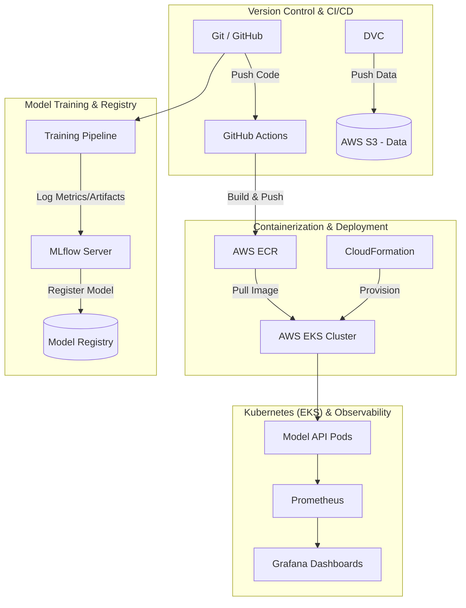

# 🚀 End-to-End MLOps Capstone Project II

[](https://www.python.org/)
[](#)
[](#)
[](#)
[](#)
[](#)
[](#)

A comprehensive, industry-standard Machine Learning Operations (MLOps) project demonstrating a fully automated pipeline. This project covers everything from data versioning and model training to cloud deployment, distributed orchestration, and real-time observability.

---

## 📑 Table of Contents
1. [Project Overview](#-project-overview)
2. [System Architecture](#-system-architecture)
3. [Tech Stack](#-tech-stack)
4. [Repository Structure](#-repository-structure)
5. [Pipeline Components](#-pipeline-components)
6. [Getting Started (Local)](#-getting-started-local)
7. [Cloud Deployment (AWS)](#-cloud-deployment-aws)
8. [API Usage](#-api-usage)
9. [Monitoring & Observability](#-monitoring--observability)
10. [License](#-license)

---

## 🎯 Project Overview

The goal of this capstone project is to bridge the gap between a local machine learning model and a production-grade, scalable, and monitored AI system. It implements best practices for:
*   **Reproducibility:** Ensuring data and code are versioned together.
*   **Automation:** CI/CD pipelines for testing, building, and deploying.
*   **Scalability:** Containerized microservices orchestrated via Kubernetes.
*   **Observability:** Tracking model drift, system health, and performance metrics.

---

## 🏗️ System Architecture



---

## 🛠️ Tech Stack

| Category | Tools | Description |
| :--- | :--- | :--- |
| **Code Versioning & CI/CD** | Git, GitHub Actions | Source code management and automated CI/CD pipelines. |
| **Data Versioning** | DVC (Data Version Control) | Tracks large datasets and model files, synced with Git. |
| **Experiment Tracking** | MLflow | Logs hyperparameters, metrics, and serves as a model registry. |
| **Containerization** | Docker | Packages the ML model and API into a portable container. |
| **Cloud Infrastructure** | AWS (S3, IAM, ECR, EKS, EC2, CloudFormation) | Cloud storage, compute, container registry, and IaC. |
| **Orchestration** | Kubernetes | Manages distributed computing, scaling, and load balancing. |
| **Observability** | Prometheus, Grafana | Scrapes metrics and visualizes system/model performance. |

---

## 📁 Repository Structure

```text
Mlops-Capstone-Project-II/
├── .github/workflows/      # GitHub Actions CI/CD pipelines (main.yml)
├── cloudformation/         # AWS CloudFormation templates for IaC
├── data/                   # Raw and processed data (Tracked by DVC)
├── k8s/                    # Kubernetes manifests (deployment, service, ingress)
├── monitoring/             # Prometheus & Grafana configuration files
├── src/                    # Source code for the ML application
│   ├── data_ingestion.py   # Data loading and preprocessing
│   ├── train.py            # Model training and MLflow logging
│   └── app.py              # FastAPI/Flask inference API
├── Dockerfile              # Instructions to build the Docker image
├── dvc.yaml                # DVC pipeline definition
├── requirements.txt        # Python dependencies
└── README.md               # Project documentation
```

---

## ⚙️ Pipeline Components

### 1. Data Versioning (DVC + AWS S3)
Instead of storing large datasets in GitHub, **DVC** is used to version data. The actual data files are pushed to an **AWS S3 bucket**, while lightweight `.dvc` pointer files are committed to Git. This ensures exact reproducibility of experiments.

### 2. Experiment Tracking (MLflow)
**MLflow** is integrated into the training script (`train.py`). It automatically logs:
*   Hyperparameters (e.g., learning rate, estimators).
*   Metrics (e.g., RMSE, Accuracy, F1-Score).
*   Artifacts (e.g., serialized `.pkl` models, feature importance plots).
The best performing model is transitioned to the `Production` stage in the MLflow Model Registry.

### 3. CI/CD Pipeline (GitHub Actions)
On every push to the `main` branch, GitHub Actions triggers a workflow that:
1.  Lints the Python code.
2.  Runs unit tests via `pytest`.
3.  Builds a Docker image containing the inference API and the production model.
4.  Authenticates with AWS IAM and pushes the image to **Amazon Elastic Container Registry (ECR)**.

### 4. Infrastructure as Code (CloudFormation)
**AWS CloudFormation** scripts are provided to programmatically provision the underlying infrastructure, including VPCs, Subnets, Security Groups, and EC2 worker nodes required for the Kubernetes cluster.

### 5. Orchestration (Kubernetes + EKS)
The Dockerized application is deployed to **Amazon Elastic Kubernetes Service (EKS)**. Kubernetes ensures high availability by managing multiple replicas of the model API, handling load balancing, and automatically restarting failed pods.

---

## 🚀 Getting Started (Local)

### Prerequisites
*   Python 3.8+
*   Docker & Docker Compose
*   AWS CLI configured (`aws configure`)
*   DVC & MLflow installed

### Installation & Local Run

1.  **Clone the repository:**
    ```bash
    git clone https://github.com/Rupeshbhardwaj002/Mlops-Capstone-Project-II.git
    cd Mlops-Capstone-Project-II
    ```

2.  **Set up the environment:**
    ```bash
    python -m venv venv
    source venv/bin/activate  # Windows: venv\Scripts\activate
    pip install -r requirements.txt
    ```

3.  **Pull the versioned data:**
    ```bash
    dvc pull
    ```

4.  **Run the DVC pipeline (Data Prep -> Train -> Evaluate):**
    ```bash
    dvc repro
    ```

5.  **Start the local MLflow UI:**
    ```bash
    mlflow ui
    # Access at http://localhost:5000
    ```

---

## ☁️ Cloud Deployment (AWS)

1.  **Provision EKS Cluster:**
    Use `eksctl` or the provided CloudFormation templates to spin up the cluster.
    ```bash
    eksctl create cluster -f cloudformation/cluster.yaml
    ```

2.  **Deploy to Kubernetes:**
    Update the `k8s/deployment.yaml` with your ECR image URI, then apply the manifests:
    ```bash
    kubectl apply -f k8s/deployment.yaml
    kubectl apply -f k8s/service.yaml
    ```

3.  **Verify Deployment:**
    ```bash
    kubectl get pods
    kubectl get svc
    ```
    *Copy the External IP of the LoadBalancer service to access your API.*

---

## 🔌 API Usage

Once deployed, you can send predictions to the model via REST API.

**Endpoint:** `POST /predict`

**Example Request:**
```bash
curl -X POST http://<K8S-LOAD-BALANCER-IP>/predict \
     -H "Content-Type: application/json" \
     -d '{"features": [5.1, 3.5, 1.4, 0.2]}'
```

**Example Response:**
```json
{
  "prediction": "Class_A",
  "confidence": 0.98
}
```

---

## 📊 Monitoring & Observability

To ensure the model performs well in production, we use **Prometheus** and **Grafana**.

1.  **Prometheus:** Scrapes metrics from the `/metrics` endpoint of our FastAPI/Flask app. It tracks:
    *   System metrics (CPU, Memory usage).
    *   Application metrics (Request latency, Error rates).
    *   Model metrics (Prediction distribution, Data drift indicators).
2.  **Grafana:** Connects to Prometheus to visualize these metrics on real-time dashboards.

**To deploy monitoring:**
```bash
kubectl apply -f monitoring/prometheus-config.yaml
kubectl apply -f monitoring/grafana-deployment.yaml
```

---

## 🤝 Contributing

Contributions are what make the open-source community such an amazing place to learn, inspire, and create. Any contributions you make are **greatly appreciated**.

1. Fork the Project
2. Create your Feature Branch (`git checkout -b feature/AmazingFeature`)
3. Commit your Changes (`git commit -m 'Add some AmazingFeature'`)
4. Push to the Branch (`git push origin feature/AmazingFeature`)
5. Open a Pull Request

---

## 📝 License

Distributed under the MIT License. See `LICENSE` for more information.

---
*Developed by [Rupesh Bhardwaj](https://github.com/Rupeshbhardwaj002)*

