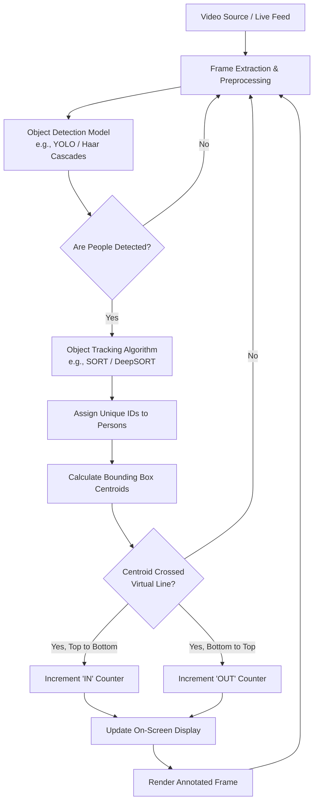

# 👣 Footfall Counter using Computer Vision


A robust and efficient Computer Vision project designed to count the number of people (footfall) entering and exiting a specific area. This project leverages object detection and tracking algorithms to monitor human movement across a defined virtual line, making it ideal for retail analytics, crowd management, and security surveillance.

---

## 🏗️ Architecture & Flow Diagram

The following diagram explains the core architecture and logical flow of the footfall counting system:



---

## 🧠 1. Approach

The project follows a systematic pipeline to achieve accurate footfall counting:
1. **Detection:** A pre-trained object detection model identifies people in the current video frame and draws bounding boxes around them.
2. **Tracking:** A tracking algorithm assigns a unique ID to every detected person and tracks their movement across consecutive frames.
3. **Line Crossing:** A virtual reference line is drawn on the frame. The system calculates the centroid (center point) of each person's bounding box.
4. **Directional Counting:** By comparing the centroid's previous and current coordinates relative to the virtual line, the system determines the direction of movement (e.g., IN vs. OUT) and updates the respective counters.

## 📹 2. Video Source Used

*   **Input:** The system processes pre-recorded video files (e.g., `.mp4`, `.avi`) or can be adapted for live RTSP camera feeds.
*   **Perspective:** The best results are achieved with an overhead or elevated angled camera view to minimize occlusion.

## 🧮 3. Explanation of Counting Logic

The counting logic relies on coordinate geometry:
*   A virtual line is defined by two points: `(x1, y1)` and `(x2, y2)`.
*   As a tracked person moves, their bounding box centroid `(Cx, Cy)` is recorded.
*   If the centroid's `y`-coordinate transitions from *above* the line to *below* the line between frames, the **IN** counter is incremented.
*   If the centroid transitions from *below* the line to *above* the line, the **OUT** counter is incremented.
*   A buffer/margin is often used to prevent double-counting caused by bounding box jitter.

---

## ⚙️ 4. Dependencies and Setup Instructions

### Requirements
Ensure you have the following installed on your system:
*   Python 3.8 or higher
*   Jupyter Notebook
*   OpenCV (`opencv-python`)
*   NumPy
*   *(Any other specific ML libraries used in the notebook, e.g., `torch`, `ultralytics`, `imutils`)*

### Installation
1. **Clone the repository:**
   ```bash
   git clone https://github.com/Rupeshbhardwaj002/footfall_couter_project.git
   cd footfall_couter_project
   ```

2. **Create a virtual environment (Optional but recommended):**
   ```bash
   python -m venv venv
   source venv/bin/activate  # On Windows use: venv\Scripts\activate
   ```

3. **Install the required packages:**
   ```bash
   pip install -r requirements.txt
   ```
   *(If a `requirements.txt` is not provided, manually install OpenCV and Jupyter: `pip install opencv-python jupyter numpy`)*

### Run the Notebook
1. Start the Jupyter Notebook server:
   ```bash
   jupyter notebook
   ```
2. Open the main `.ipynb` file in your browser.
3. Run the cells sequentially to process the video and view the output.

---

## ⚠️ 5. Drawbacks & Limitations

While the system is effective, it currently faces a few challenges:

*   **Overlapping People Issue (Occlusion):** When multiple people walk closely together or block each other from the camera's perspective, the detection model may merge them into a single bounding box or lose track of individuals, leading to undercounting.
*   **Dependence on Video Angle:** The accuracy of the virtual line crossing logic is highly sensitive to the camera angle. Extreme angles can distort centroid calculations. An overhead (top-down) view is strongly recommended.
*   **Limited Real-Time Performance:** Depending on the complexity of the detection model (e.g., heavy deep learning models) and the hardware used (lack of GPU), the system may experience frame drops, reducing real-time processing capabilities.

---

## 🚀 Future Improvements
*   Implement a more robust tracking algorithm (like DeepSORT or ByteTrack) to handle occlusions better.
*   Optimize the model using TensorRT or ONNX for faster, real-time edge deployment.
*   Add a web dashboard to visualize footfall analytics over time.

---

## 🤝 Contributing
Contributions, issues, and feature requests are welcome! Feel free to check the [issues page](https://github.com/Rupeshbhardwaj002/footfall_couter_project/issues).

## 📝 License
This project is open-source and available under the [MIT License](LICENSE).
